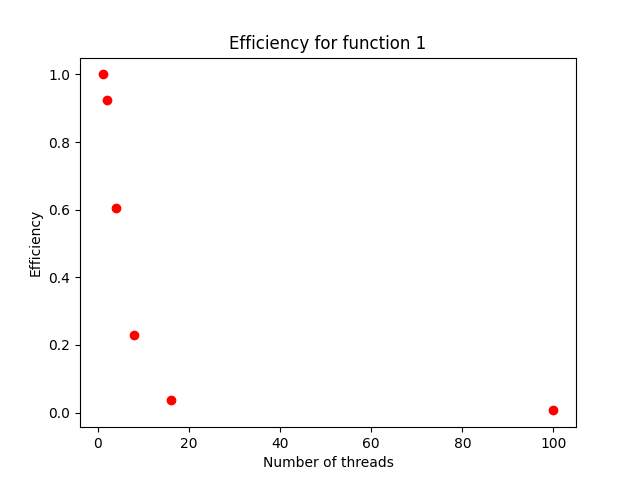
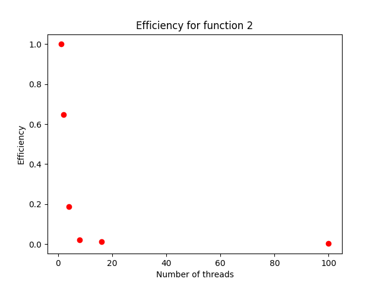
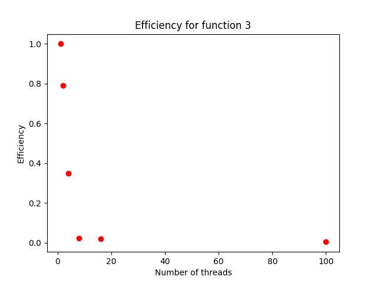
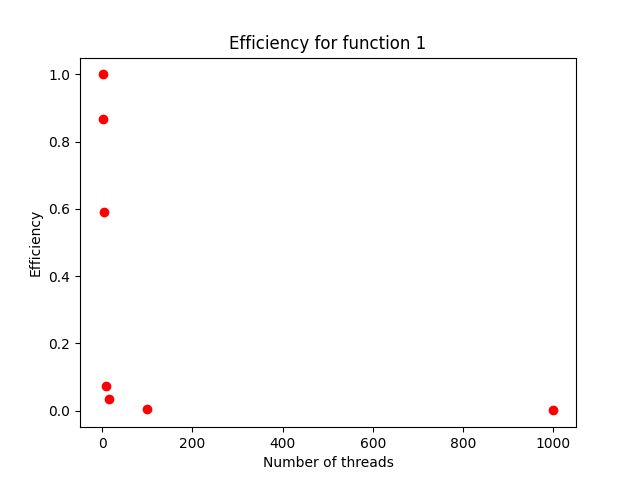
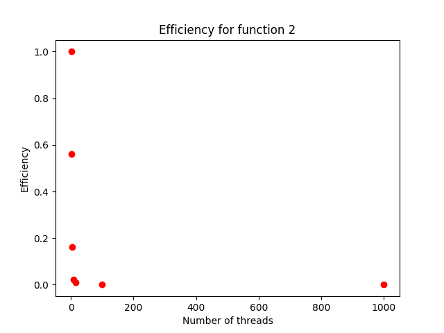
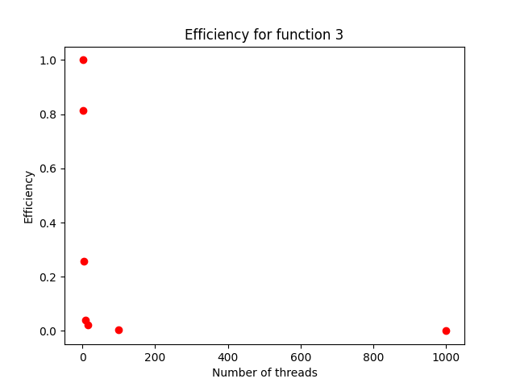

# Lab work <mark>4</mark>: <mark>Integration with thread-safe queues</mark>
Authors (team):
- <a href="https://github.com/shnasta">_Anastasiia Shvets_</a>
- <a href="https://github.com/YarynaFialko">_Yaryna Fialko_</a><br>
## Prerequisites

### C++ prerequisites:
#### - cmake
#### - g++
#### - python3
### Compilation

<mark>HOW TO COMPILE YOUR PROGRAM? (RECOMMENDED: ./comile.sh)</mark>

### Installation

```
$ ./compile.sh
```

### Run Python code

Python script run (where n - number of executions):
```
$ python3 ./prog_runner.py  n
```

### Run C++ code
Where 
* N - number of function.
* M - number of threads.
* P - points per task.
```
$ ./bin/integrate_parallel N ./funcN.cfg M P
```

### Usage
#### C++ code usage:


```
$ ./bin/integrate_parallel_queue.exe 1 ./func1.cfg 4 500
4.54545e+06
0.0230792
5.07743e-09
341
```

#### Python scrypt usage:


```
$ python3 ./prog_runner.py 3 3 500
Function 1:
Result of integration: 4545450.0
Absolute error: 0.0230792
Relative error: 5.07743e-09
Min execution time: 101 ms
Avg execution time: 109.0 ms
Corrected sample standard deviation: 9.17 ms

Function 2:
Result of integration: 857208.0
Absolute error: 0.00117024
Relative error: 1.36517e-09
Min execution time: 4104 ms
Avg execution time: 4205.0 ms
Corrected sample standard deviation: 87.48 ms

Function 3:
Result of integration: -1.60466
Absolute error: 9.22735e-06
Relative error: 5.75034e-06
Min execution time: 78 ms
Avg execution time: 89.0 ms
Corrected sample standard deviation: 9.64 ms
```

### Results
In this lab we learned how to implement a thread-safe queue and applied it to in parallel integrate functions. Also, we visualized the efficiency of the methon via graph and complared it with the previous approach from lab3. Thread-safe queues are an efficient and effective way to manage communication and data exchange in complex systems, particularly in situations where multiple threads or processes are involved like in the integration. Thread-safe queues provide a simple and efficient method of exchange of data avoiding data race.

#### Graphs

- Points per task in the following graphs: 500.
- Number of executions: 1.








