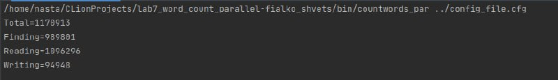
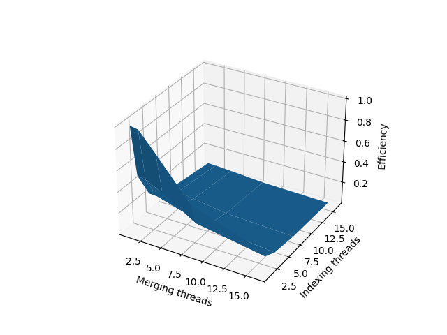
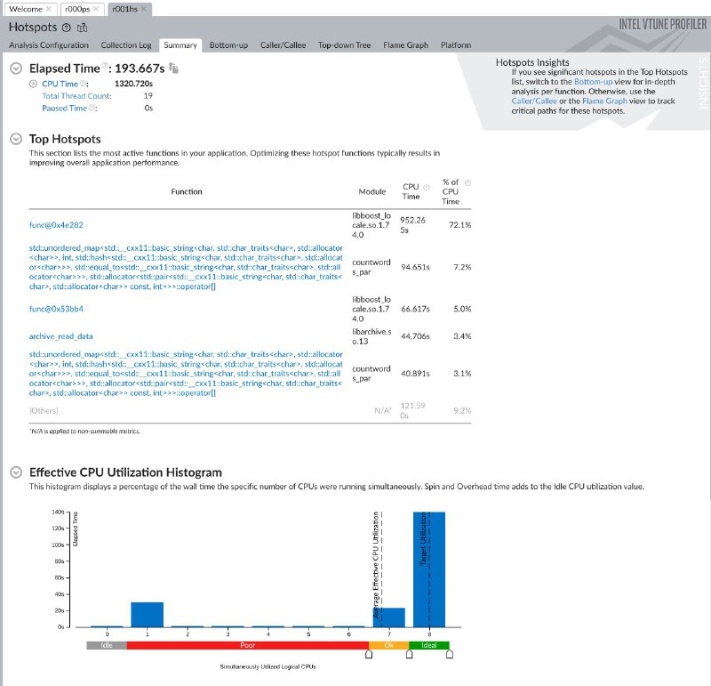
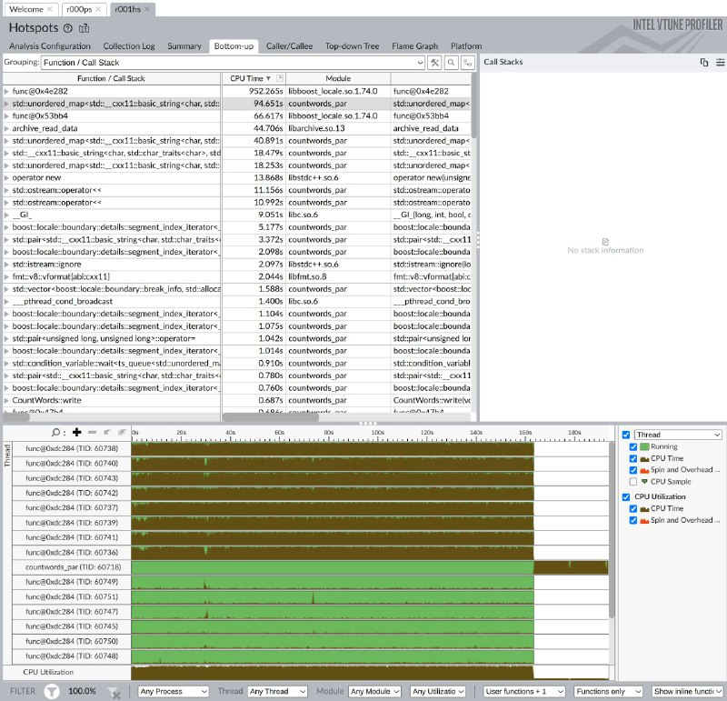

# Lab work 7: Parallel word count
Authors (team):
- <a href="https://github.com/shnasta">_Anastasiia Shvets_</a>
- <a href="https://github.com/YarynaFialko">_Yaryna Fialko_</a><br>
## Prerequisites

#### - cmake
#### - g++
#### - python3

### Compilation

```
$ ./compile.sh -O
```

### Run C++ code
Where:
* P - path to configuration file
```
$ ./bin/countwords_par P
```

### Run Python script
Where: 
* E - number of executions
* C - cache flush (1- flush, 0 - not flush)
```
python3 prog_runner.py E C
```
If C = 1, the script needs to be run with sudo
```
sudo python3 prog_runner.py E C
```


### Plotting with python script
Where: 
* E - number of executions
* C - cache flush (1- flush, 0 - not flush)
```
python3 plot_maker.py E C
```
If C = 1, the script needs to be run with sudo
```
sudo python3 plot_maker.py E C
```


### Configuration file example
All parameters are required. 
```
indir= "../../../acs_words_count/3/3" # Path to directory to index
out_by_a= "../res_a.txt" # Results, sorted by alphabet
out_by_n= "../res_n.txt" # Results, sorted by number of occurrences
indexing_extensions = .txt # Extensions of files to index
archives_extensions = .zip # Extensions of archives to index
max_file_size = 10000000 # Maximum file size to index
indexing_threads= 4 # Number of threads for indexing the directory
merging_threads= 4 # Number of threads for merging dictionaries
filenames_queue_size = 100 # Size of queue for filenames
raw_files_queue_size = 100 # Size of queue for raw files
dictionaries_queue_size = 100  # Size of queue for dictionaries
```


### Results
- [Folder with results files Google Drive link](https://drive.google.com/drive/folders/1hl6GoC3R3cQ9kz_kI0_n6uCndc-LTZVU?usp=share_link)

Results for 3 directory with 4 indexing and 4 merging threads:
```angular2html
$ python3 prog_runner.py 5 0
207143                                      # Total
210869.8
3682.831207101406

4443                                        # Finding
4736.8
391.00537080710285

102582                                      # Reading
103556.2
1174.8630558494892

26351                                       # Writing
26677.8
286.67001936023934
```

```angular2html
$ sudo python3 prog_runner.py 5 1
213995
221330.0
4221.685563847692

5324
5447.2
77.12781599397198

106017
110100.4
2367.359985300081

26511
26870.8
273.33349593491096
```

Whole library results:

With 4 threads for indexing and 4 threads for merging.

Approximately, it took 2.5 - 3 Gb of RAM to run the program.



```angular2html
Total=1170913
Finding=989801
Reading=1096296
Writing=94948
```

### Efficiency plot

> Run on such threads: [1, 2, 4, 8, 16]



### Profiler results

Provided profiler results show that mallocs aren't among top hotspots, therefore we can assume that there are no memory leaks.
Also, it demonstrated that the libbost and unordered map are the top hotspots, which is completely logical as the program constantly manipulates with the map's data.





Overall, the program is quite efficient and successfully parallels the task or word counting.


###  Characteristics of the computer on which the tests were performed
#### CPU:
- Intel Core Kaby Lake i7-8650U 64/64  processors:1 cores:4 1.9GHz HyperThreading
- L1i:32 Kb/core, 8-way set ass. L1d:32 Kb/core, 8-way set ass. L2: 256 Kb/core, 4-way set ass. L3: 2 Mb/core, 16-way set ass.
- Last Level TBL: L2 TLB: 1-MB, 4-way set associative, 64-byte line size Shared 2nd-Level TLB: 4-KB / 2-MB pages, 6-way associative, 1536 entries. Plus, 1-GB pages, 4-way, 16 entries
- SSE4.1, SSE4.2 AVX2 AES, RDSEED
#### RAM:
- 8 GB DDDR4 SDRAM  1 Numa node 1 x SODIMM 2400 MHz Integrated

