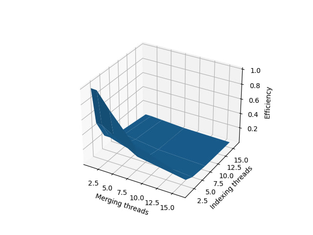

# Lab work 8: Parallel word counting: use of external queues and dictionaries
Authors (team):
- <a href="https://github.com/shnasta">_Anastasiia Shvets_</a>
- <a href="https://github.com/YarynaFialko">_Yaryna Fialko_</a><br>

## Prerequisites

#### - cmake
#### - g++
#### - python3
#### - boost
#### - tbb 

### Compilation

```
$ ./compile.sh -O
```

### Run C++ code
Where:
* P - path to configuration file
```
$ ./bin/countwords_par_proftools P
```

### Run Python script
Where:
* E - number of executions
* C - cache flush (1- flush, 0 - not flush)
```
python3 prog_runner.py E C
```
If C = 1, the script needs to be run with sudo
```
sudo python3 prog_runner.py E C
```


### Plotting with python script
Where:
* E - number of executions
* C - cache flush (1- flush, 0 - not flush)
```
python3 plot_maker.py E C
```
If C = 1, the script needs to be run with sudo
```
sudo python3 plot_maker.py E C
```


### Configuration file example
All parameters are required.
```
indir= "../../../acs_words_count/3/3" # Path to directory to index
out_by_a= "../res_a.txt" # Results, sorted by alphabet
out_by_n= "../res_n.txt" # Results, sorted by number of occurrences
indexing_extensions = .txt # Extensions of files to index
archives_extensions = .zip # Extensions of archives to index
max_file_size = 10000000 # Maximum file size to index
indexing_threads= 4 # Number of threads for indexing the directory
merging_threads= 4 # Number of threads for merging dictionaries
filenames_queue_size = 100 # Size of queue for filenames
raw_files_queue_size = 100 # Size of queue for raw files
dictionaries_queue_size = 100  # Size of queue for dictionaries
```


### Results
- [Folder with results files Google Drive link](https://drive.google.com/drive/folders/1hhesSanfVFoRI1zZxJsMSIVIPDSEqTuC)

Results for the whole Gutenberg library:


```angular2html
Total=1069229
Finding=1069166
Reading=1069222
Writing=78953
```
With 4 threads for indexing and 4 threads for merging.

### Efficiency plot

> Run on such threads: [1, 2, 4, 8, 16]



Results for 3d folder in Gutenberg library:

queue size = 10000 <br/>
indexing_threads = 4 <br/>
merging_threads = 4 

#### With TBB:
```angular2html 
~/CLionProjects/lab8_word_count_external_tools-fialko_shvets sudo python3 prog_runner.py 5 0
204194
204735.0
408.26584476294363

4373
4649.8
425.35244209949

100654
101355.8
446.94708859103224

26320
26573.6
202.09972785731307
```
    
```angular2html
~/CLionProjects/lab8_word_count_external_tools-fialko_shvets sudo python3 prog_runner.py 5 1
206312
210243.4
2269.6477259698254

5152
5388.0
133.2422605632312

101811
104537.2
1539.3897167384223

26691
26900.0
144.75841944425892
```

#### With our queue:

```angular2html
$ python3 prog_runner.py 5 0
207143                                      # Total
210869.8
3682.831207101406

4443                                        # Finding
4736.8
391.00537080710285

102582                                      # Reading
103556.2
1174.8630558494892

26351                                       # Writing
26677.8
286.67001936023934
```

```angular2html
$ sudo python3 prog_runner.py 5 1
213995
221330.0
4221.685563847692

5324
5447.2
77.12781599397198

106017
110100.4
2367.359985300081

26511
26870.8
273.33349593491096
```


### Results table
(without cache flush)


|         |                        | TBB                                  | Our queue                             |
|---------|------------------------|--------------------------------------|---------------------------------------|
| Total   | min<br/>mean<br/>stdev | 204194 <br/>204735.0<br/> 408.26     | 207143 <br/>210869.8<br/> 3682.83     |
| Finding | min<br/>mean<br/>stdev | 203608 <br/> 206968.0 <br/> 2050.22  | 4443 <br/> 4736.8 <br/> 391.01        |
| Reading | min<br/>mean<br/>stdev | 204750 <br/> 208117.2  <br/> 2048.06 | 102582  <br/> 103556.2  <br/> 1174.86 |
| Writing | min<br/>mean<br/>stdev | 26351 <br/> 26573.6 <br/> 202.10     | 26351 <br/> 26677.8 <br/> 286.67      |


### Results table
(with cache flush)


|         |                        | TBB                                  | Our queue                             |
|---------|------------------------|--------------------------------------|---------------------------------------|
| Total   | min<br/>mean<br/>stdev | 206312 <br/>210243.4<br/> 2269.65    | 213995 <br/>221330.0<br/> 4221.69     |
| Finding | min<br/>mean<br/>stdev | 4373 <br/> 4649.8 <br/> 425.35       | 5324 <br/> 5447.2 <br/> 77.13         |
| Reading | min<br/>mean<br/>stdev | 101811 <br/> 104537.2  <br/> 1539.39 | 106017  <br/> 110100.4  <br/> 2367.36 |
| Writing | min<br/>mean<br/>stdev | 26691 <br/> 26900.0 <br/> 144.76     | 26511 <br/> 26870.8 <br/> 273.33      |


### Profiling
Approximately, it took 2 - 2.3 Gb of RAM to run the program on the whole Gutenberg library.

### Analysis of results

#### TBB vs our queue

- TBB is faster than our queue in finding files and reading files.
- Our queue and TBB are almost the same in writing files. 
- TBB is faster than our queue in total time. 
- TBB is more stable than our queue. (TBB has smaller standard deviation than our queue)
- TBB uses less RAM than our queue ( 2 - 2.3 Gb vs. 2.5 - 3 Gb).


####  The differences in performance and memory usage between TBB and "Our queue" could be attributed to several factors. Here are some possible explanations:

- <b> Thread synchronization and task scheduling: </b> TBB may have a more efficient implementation of thread synchronization and task scheduling algorithms, allowing it to better utilize the available resources and avoid contention for shared resources like CPU and memory. This could result in faster execution and lower memory usage.

- <b> Data structures:  </b>  TBB may use more efficient data structures for storing and accessing the files being processed, resulting in faster search and retrieval times and lower memory usage.

- <b> Memory management:  </b>  TBB may use more efficient memory management techniques such as memory pooling or memory reuse, allowing it to minimize memory allocation and deallocation overhead, which could lead to lower memory usage.

-  <b> Compiler optimizations:  </b> TBB may have been compiled with more aggressive compiler optimizations than "Our queue", resulting in faster and more efficient code execution.

- <b> Structure change: </b> . Our queue uses a dictionary queue and merging threads to merge pairs of dictionaries, whereas TBB uses a single global dictionary that is merged by all merging threads. The dictionary queue in Our queue may require additional memory overhead to maintain the queue structure and to perform the merging of the dictionaries in separate threads. On the other hand, TBB's global dictionary approach may simplify the merging process and reduce memory overhead by avoiding the need for a queue structure.
### Conclusions
In summary, the performance and memory usage of TBB and "Our queue" implementations for file processing were compared. The results showed that TBB was faster than our queue in finding and reading files, and had lower memory usage. The two implementations had similar performance in writing files. TBB also demonstrated more stable performance with a smaller standard deviation in execution times.

The differences in performance and memory usage could be due to various factors, such as differences in thread synchronization, task scheduling algorithms, data structures, memory management, and compiler optimizations.

Overall, TBB appears to be a more efficient implementation for parallel file processing tasks, but the choice of implementation may depend on specific use cases and requirements.

###  Characteristics of the computer on which the tests were performed
#### CPU:
- Intel Core Kaby Lake i7-8650U 64/64  processors:1 cores:4 1.9GHz HyperThreading
- L1i:32 Kb/core, 8-way set ass. L1d:32 Kb/core, 8-way set ass. L2: 256 Kb/core, 4-way set ass. L3: 2 Mb/core, 16-way set ass.
- Last Level TBL: L2 TLB: 1-MB, 4-way set associative, 64-byte line size Shared 2nd-Level TLB: 4-KB / 2-MB pages, 6-way associative, 1536 entries. Plus, 1-GB pages, 4-way, 16 entries
- SSE4.1, SSE4.2 AVX2 AES, RDSEED
#### RAM:
- 8 GB DDDR4 SDRAM  1 Numa node 1 x SODIMM 2400 MHz Integrated

