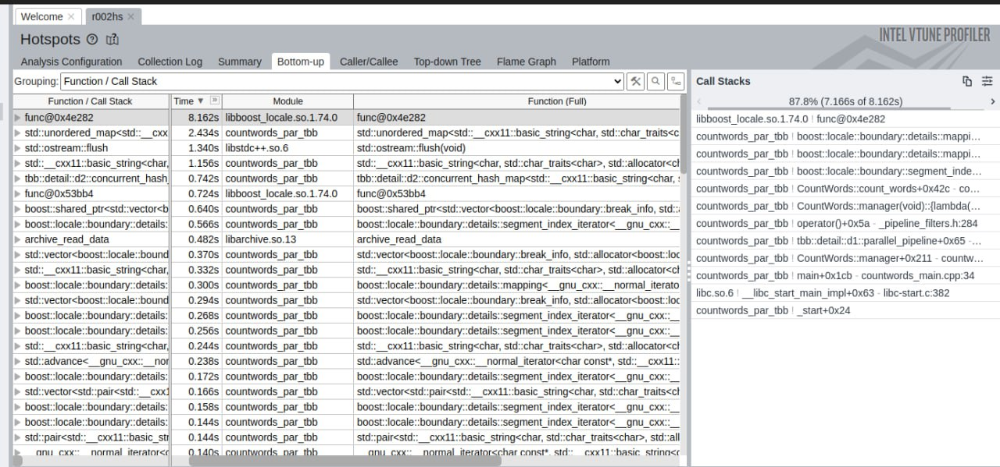
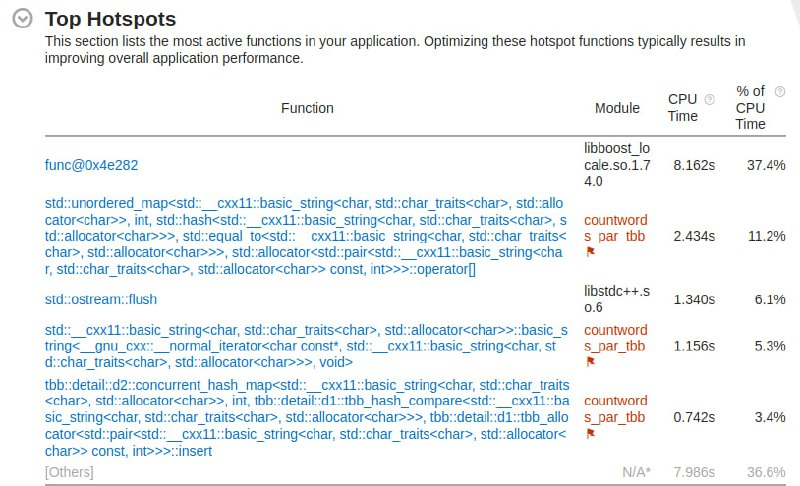

# Lab work 9: Parallel word count - Third-party high-level tool
Authors (team):
- <a href="https://github.com/shnasta">_Anastasiia Shvets_</a>
- <a href="https://github.com/YarynaFialko">_Yaryna Fialko_</a><br>

## Prerequisites

### Compilation

#### - cmake
#### - g++
#### - python3
#### - boost
#### - tbb 


### Compilation

```
$ ./compile.sh -O
```

### Run C++ code
Where:
* P - path to configuration file
```
$ ./bin/countwords_par_proftools P
```

### Run C++ code
Where:
* P - path to configuration file
```
$ ./bin/countwords_par_tbb P
```

### Run Python script
Where:
* E - number of executions
* C - cache flush (1- flush, 0 - not flush)
```
python3 prog_runner.py E C
```
If C = 1, the script needs to be run with sudo
```
sudo python3 prog_runner.py E C
```

### Plotting with python script
Where:
* E - number of executions
* C - cache flush (1- flush, 0 - not flush)
```
python3 plot_maker.py E C
```
If C = 1, the script needs to be run with sudo
```
sudo python3 plot_maker.py E C
```

### Configuration file example
All parameters are required.
```
indir= "../../../acs_words_count/3/3" # Path to directory to index
out_by_a= "../res_a.txt" # Results, sorted by alphabet
out_by_n= "../res_n.txt" # Results, sorted by number of occurrences
indexing_extensions = .txt # Extensions of files to index
archives_extensions = .zip # Extensions of archives to index
max_file_size = 10000000 # Maximum file size to index
```
### Results
- [Folder with results files Google Drive link](https://drive.google.com/drive/u/0/folders/1l9VxYLz3itqbhVqCmgeRfam0LBmQnpeK)

- Limit of 16 live tokens in pipeline

```angular2html
./bin/countwords_par_tbb ./config_file.cfg 
Total=1778732
Finding=4982
Reading=28457
Writing=145706
```

### With TBB

```angular2html
sudo python3 prog_runner.py 5 0                                                                          
339478
343524.2
3605.027974926131

4
706.8
1563.1297770818649

144
1571.0
3177.4547990490755

41666
42374.0
711.531095595969
```


```angular2html
sudo python3 prog_runner.py 5 1
344489
345630.4
754.6120195173146

759
893.4
208.48093438010105

4137
4297.0
244.4575627793094

41982
43258.0
786.0477084757642
```
### Previous implementation 
    
```angular2html
sudo python3 prog_runner.py 5 1
404336
405793.0
2060.5091603775995

9165
9403.5
337.28993462598316

200852
202454.5
2266.277233702885

40637
41423.0
1111.5718600252528
```

### Results table
(with cache flush)

|         |                        | TBB                              | Previous Implementation               |
|---------|------------------------|----------------------------------|---------------------------------------|
| Total   | min<br/>mean<br/>stdev | 344489 <br/>345630.4<br/> 754.61 | 404336 <br/>405793.0<br/> 2060.50     |
| Finding | min<br/>mean<br/>stdev | 759 <br/> 893.4 <br/> 208.48     | 9165 <br/> 9403.5 <br/> 337.28        |
| Reading | min<br/>mean<br/>stdev | 4137 <br/> 4297.0  <br/> 244.45  | 200852  <br/> 202454.5  <br/> 2266.27 |
| Writing | min<br/>mean<br/>stdev | 41982 <br/> 43258.0 <br/> 786.04 | 40637 <br/> 41423.0 <br/> 1111.57     |


### Profiling





###  Characteristics of the computer on which the tests were performed
#### CPU:
- Intel Core Kaby Lake i7-8650U 64/64  processors:1 cores:4 1.9GHz HyperThreading
- L1i:32 Kb/core, 8-way set ass. L1d:32 Kb/core, 8-way set ass. L2: 256 Kb/core, 4-way set ass. L3: 2 Mb/core, 16-way set ass.
- Last Level TBL: L2 TLB: 1-MB, 4-way set associative, 64-byte line size Shared 2nd-Level TLB: 4-KB / 2-MB pages, 6-way associative, 1536 entries. Plus, 1-GB pages, 4-way, 16 entries
- SSE4.1, SSE4.2 AVX2 AES, RDSEED
#### RAM:
- 8 GB DDDR4 SDRAM  1 Numa node 1 x SODIMM 2400 MHz Integrated

