# Lab work 5: STM32
# Directed light and Binary counter
> Authors (team): Shvets Anastasiia, Fialko Yaryna 

## Prerequisites

* STM32F411E-DISCO    (real device)
* STM32CubeIDE    (application)

## Results
#### Directed light
After you flash your STM32, you will see he leds blinking in circle order. 
You can press the blue button to change its direction.

  

#### Binary counter
After you flash your STM32 and construct the scheme, you have to press the button to see that something is happening.  
The number of times button been pressed will appear on the led bar in binary format.

  

## Configuration
> in STM32CubeIDE

### Directed light
###### Leds

To apply PWM we should choose *TIM4_CHx* in leds (PD12, PD13, PD14, PD15 pins) options. 
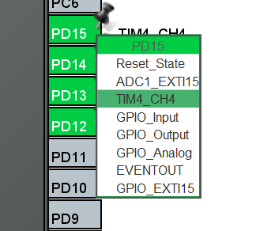  
 
And then in `Timers` choose `TIM4` and set the settings as follows:
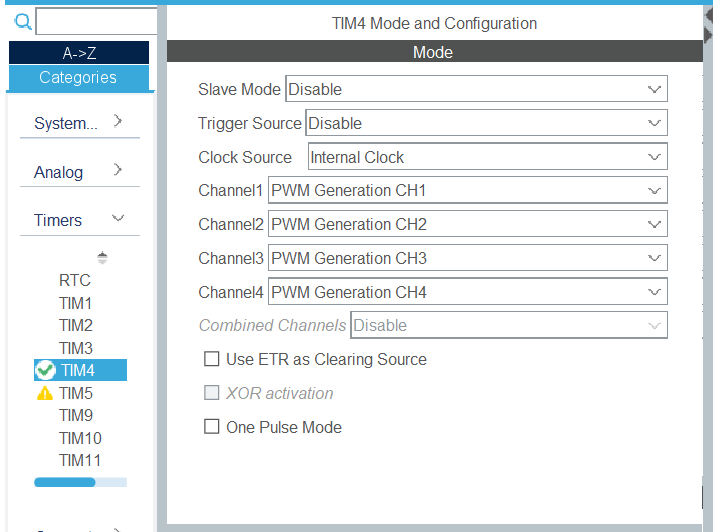  
Pay attention to **Clock Source** and **Channelx**. 
 
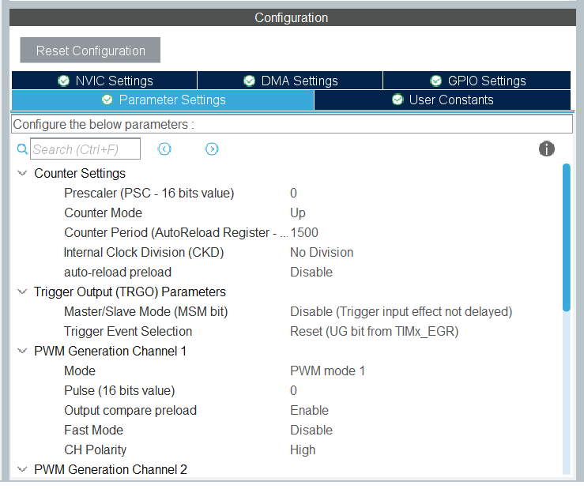  
Pay attention to **Counter Period**.

###### Button interrupt
Also, to make the button able to interrupt choose in PA0 pin options *GPIO_EXTI0*. 
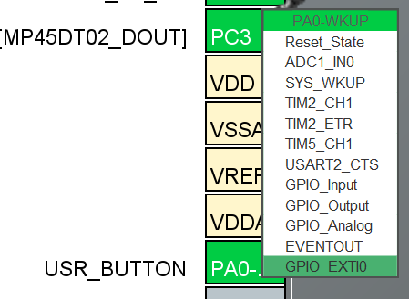 
 
In `GPIO` choose PA0 to config it, and set **GPIO mode** as *Interrupt with Rising/Falling edge trigger*,  and also set **User Label** as *"USR_BUTTON"*. 
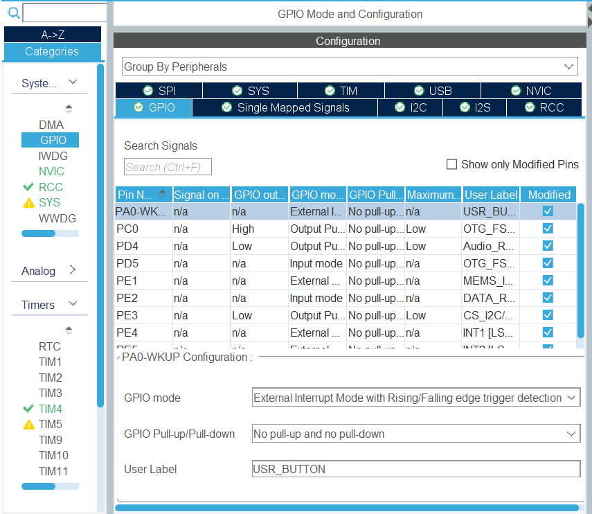 
 
In `GPIO` go to `NVIC` section and enable interrupt on *EXTI line0*.
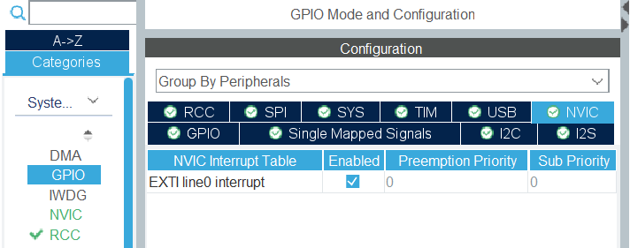  
 

### Binary counter
###### Leds
Set all of PE6 - PE15 pins as *GPIO_Output*.
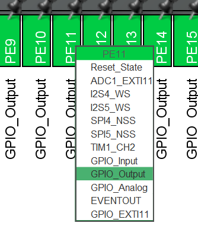  

###### Button interrupt
Also, to make the button able to interrupt choose in PA1 pin options *GPIO_EXTI1*. 
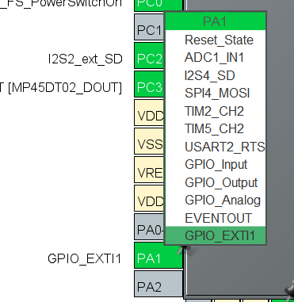  
 
In `GPIO` choose PA1 to config it, and set **GPIO mode** as *Interrupt with Rising/Falling edge trigger*. 
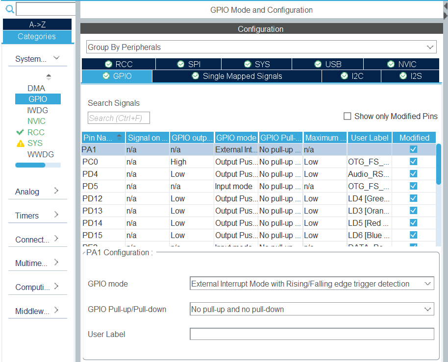  
 
In `GPIO` go to `NVIC` section and enable interrupt on *EXTI line1*.  
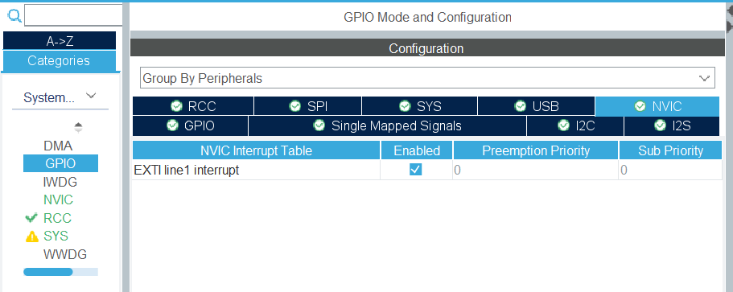  
 

### The scheme for binary counter
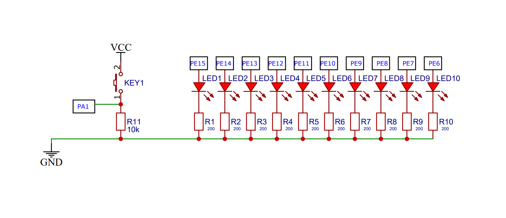  

## Additional tasks
#### Directed light
* Task 1: Use PWM to make leds dim.
* Task 2: Use interrupts.
#### Binary counter
* Task 1: Use interrupts.

