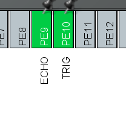

# Lab 6. Range-finder - HC-SR04

Team members: Shvets Anastasiia, Fialko Yaryna

## Prerequisites

### Hardware

- Board STM32F411E-Disco
- HC-SR04 Sensor
- Nokia 5110 LCD

### Software

- STM32CubeIDE

## Result

On Nokia 5110 LCD will be writen: "Distance: `x` cm", where `x` is distance in centimetres from your HC-SR04 to the first obstacle.

## Configuration
> in STM32CubeIDE

Steps to configure the project:

For the pins shown in the screenshots below, set the user labels:

Select the following modes for the pins:
- PE9 - GPIO_EXTI9
- PE10 - GPIO_Output

And for LCD:
- PD9 - GPIO_Output
- PD8 - GPIO_Output
- PB15 - SPI2_MOSI
- PB14 - GPIO_Output
- PB13 - SPI2_SCK

Go to the Multimedia tab and disable I2S2.

Go to the Connectivity tab and enable SPI2 to be used as Transmit only master. 
And in the Parameter Settings window, set the following parameters:
- Prescaler - 8

Go to the Timers tab and enable TIM10 with the following parameters:
- Prescaler - 95
- Counter Period - 10000

After that, go to the System Core tab -> NVIC and enable the following interrupts:

- TIM1 update interrupt and TIM10 global interrupt
- EXTI Line[9:5] interrupts

In GPIO section select PE9 pin and change the **GPIO mode** to *External Interrupt with Rising/Falling edge trigger detection*.

Go to RCC section:

* Set both HSE and LSE to Crystal/Ceramic Resonator.

## Schematics
The schematics of the project is shown below:

## Additional tasks

* Implement a device using interrupts and timers, so that the code does not use busy loops.

This was achieved by using timer and finite state machine.
